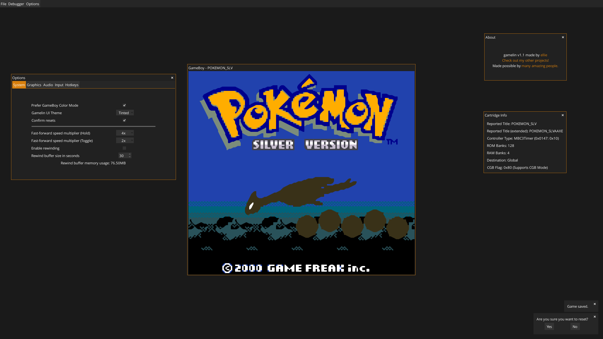
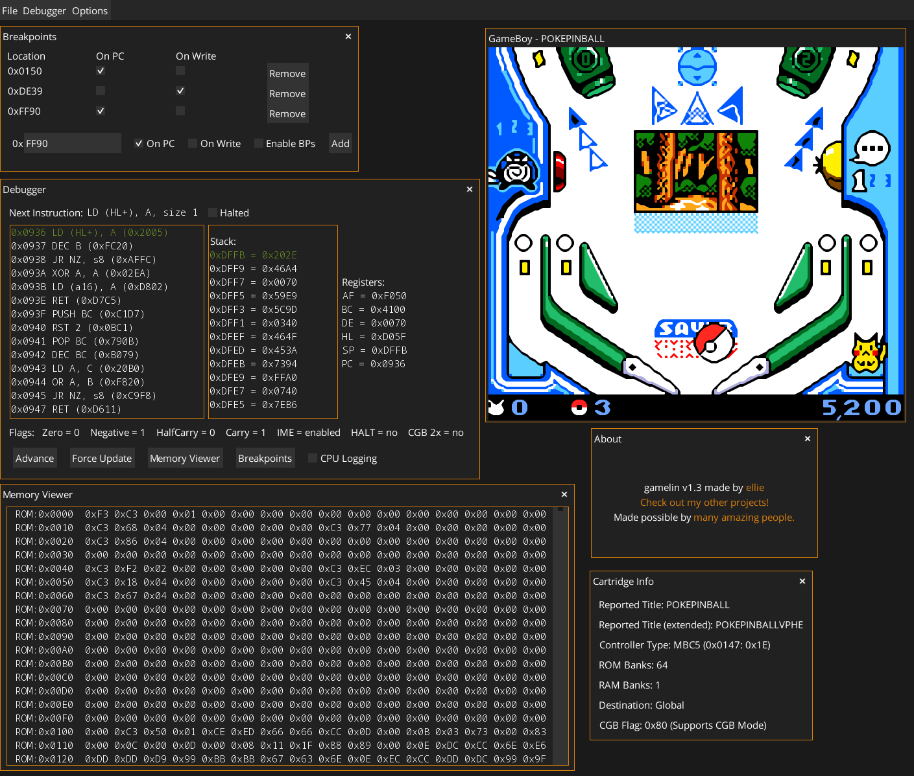
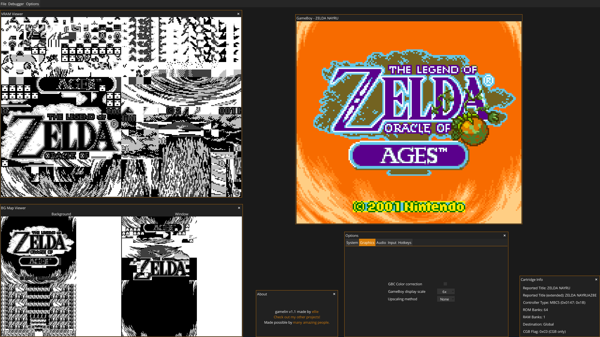

# Gamelin
A Gameboy (Color) emulator written in Kotlin, able to run on desktop/JVM (with LibGDX + VisUI) 
and [in browser](https://gamelin.angm.xyz) (with Bootstrap and KorAU).

## Status
The emulator is in a good and usable state. Both DMG and CGB emulation is complete and 
quite accurate, enough to make most commercial games run perfectly.

### Desktop Version
##### Features
- Upscaling with HQ2X, HQ3X and HQ4X
- `.sav` game saving compatible with most other emulators (BGB, VBA, ...)
- Save states with "undo last load" function
- Live rewinding of games for up to 60 seconds
- Fast-forwarding at any integer multiplier (with hold and toggle hotkeys)
- Basic gamepad/controller support
- Debugger with:
    - Emulator halting / Line-by-line debugging
    - PC and write breakpoints
    - Memory, register and stack view
    - Tileset and BG Map Viewers
    - Cartridge Info Viewer
    - Per-instruction CPU/register state logging
    - Instruction Set Viewer

##### Playing Pokemon Silver with HQ4X upscaling

##### Pokemon Pinball with running debugger and memory viewer

##### TLoZ: Oracle of Ages with some visual debugging tools open


##### Web Version - [gamelin.kjs](https://gamelin.angm.xyz)
- Entire emulator working fully
- Full game saving and RTC support (into browser local storage)

#### Missing console features
- Some MBC3 controllers have a built-in RTC for keeping track of time; Gamelin implements it,
but in a very simple format incompatible with other emulators that has a high chance of
not working with most games (it was tested with Pokemon Crystal and successfully kept time
after turning the game off overnight - needs more testing).

### Tested games
Here's a non-exhaustive list of games I've tested. Results might sometimes be outdated.
All games that support both DMG/GB and CGB/GBC were tested in GBC mode.

##### Perfect with no observable issues
- Pokemon Blue (Global, 1996, Game Freak)
    - Tested until Viridian Forest
- Pokemon Silver (Global, 2000, Game Freak)
    - Played until first GYM, including Bellsprout Tower
- Pokemon Crystal (Global, 2001, Game Freak)
    - Played until reaching Bellsprout Tower
- Dr. Mario (Global version, 1990, Nintendo)
- Tetris (JP and Global versions, 1989, Nintendo)
- Tetris DX (Global, 1998, Nintendo)
- Pokemon Pinball (Global, 1999, Jupiter)
- Super Mario Land (Global, Nintendo)
    - Played until 2-1
- Super Mario Land 2 (Global, 1992, Nintendo)
    - Played the first level
- Super Mario Bros. Deluxe (Global, 1999, Nintendo)
    - Played until 1-3, other modes also briefly tested
- Wario Land 3 (Global, 2000, Nintendo)
    - Played the first level
- The Legend of Zelda: Link's Awakening (Global, 1993, Nintendo)
    - Played until shortly after obtaining your sword at the shore
- The Legend of Zelda: Link's Awakening DX (Global, 1998, Nintendo)
    - Played until finding the toadstool in the mysterious woods
- The Legend of Zelda: Oracle of Ages (Global, 2001, Nintendo)
    - Played until receiving the wooden sword
- Kirby's Dream Land (Global, Nintendo/HAL)
    - Played until middle of stage 2
- Donkey Kong (Global, 1994, Nintendo)
- Donkey Kong Land (Global, 1995, Nintendo/RARE)
    - Tested for the first 2 levels
- Donkey Kong Country (Global, 2000, RARE)
    - Played the first level
- Yoshi (Global, 1992, Nintendo)
- Tic-Tac-Toe (1996, Norman Nithman)

##### Small issues, fully playable
- Pokemon Yellow (Global, Game Freak)
    - None of the Pikachu sound effects actually play (they're just low volume noise)
    - Played until first rival fight

## Goals
The main goals of this emulator is to both learn more about emulation of real-world hardware
as well as creating a nice-to-use emulator with many comfort features that should be able
to run well in the browser. Accuracy is only a goal when it fixes issues encountered
by actual games; implementing complex but ultimately useless hardware details that aren't used by games
(like the OAM bug or MBC1 multicarts) is not a goal of this emulator, particularly considering
the speed requirements needed to make it work in the browser.

## Build
``` bash
# Run on desktop
./gradlew run

# Create jarfile
./gradlew dist

# Create web build in web/
./gradlew distJs
```

## Testing
Blargg, mooneye and acid2 ROMs can be run automatically using gradle:
```bash
gradle jvmTest
```

Note that by default, only passing tests are run to allow easily catching regressions.
To run all tests, change `TEST_ALL` in `src/jvmTest/xyz/angm/gamelin/tests/ProjectConfig.kt` to `true`.

#### Blargg test results
- `cpu_instrs`, `mem_timing`, `mem_timing-2`, `instr_timing`, `interrupt_time`: Pass
- `dmg_sound`: 8/12 pass (07, 09, 10, 12 fail)
- `cgb_sound`: 7/12 pass (07, 08, 09, 11, 12 fail)
- `oam_bug`: Everything but 3 and 6 fail (OAM bug won't be implemented)

#### Mooneye test results
- `acceptance`: 27 out of 75 pass
- `emulator-only`: All pass (except MBC1 multicart; will not be supported)

#### Acid2
Both the `dmg-acid2` and `cgb-acid2` test written by Matt Currie pass (CGB in DMG mode untested).
Thank you to [@mattcurrie](https://github.com/mattcurrie) for creating them!

## Thanks To
- [Imran Nazar, for their series of blog posts on GB emulation](http://imrannazar.com/GameBoy-Emulation-in-JavaScript:-The-CPU)
- [Michael Steil, for The Ultimate Game Boy Talk](https://media.ccc.de/v/33c3-8029-the_ultimate_game_boy_talk)
- [kotcrab, for creating the xgbc emulator I often used to confirm/understand fine behavior as well as VisUI](https://github.com/kotcrab/xgbc)
- [czyzby, for making the VisUI Tinted skin](https://github.com/kotcrab/vis-ui-contrib/tree/master/skins/tinted)
- [stan-roelofs, for their emulator, which I abridged the sound implementation from](https://github.com/stan-roelofs/Kotlin-Gameboy-Emulator)
- [Megan Sullivan, for her list of GB opcodes](https://meganesulli.com/blog/game-boy-opcodes)
- [gbdev.io for a list of useful resources](https://gbdev.io)
- [metaphore, who made the hqx filter implementation Gamelin uses](https://gist.github.com/metaphore/b4750be45289109b3d49c97b5c300db6)
- [danwsong, whose gemuboi-js emulator inspired gamelin.kjs's design](https://github.com/danwsong/gemuboi-js)
- blargg, Gekkio and mattcurie for their test ROMs and retrio for hosting blargg's ROMs
- You, for reading this :)
